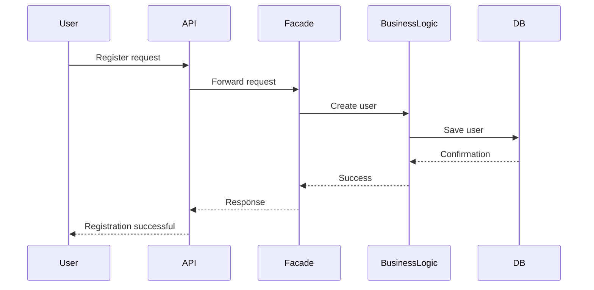
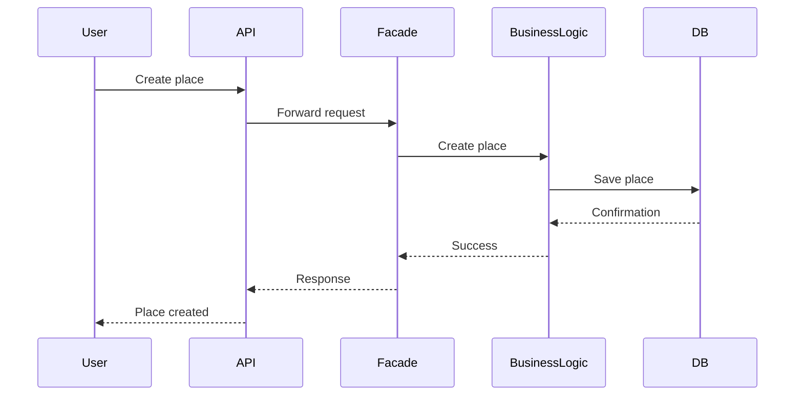
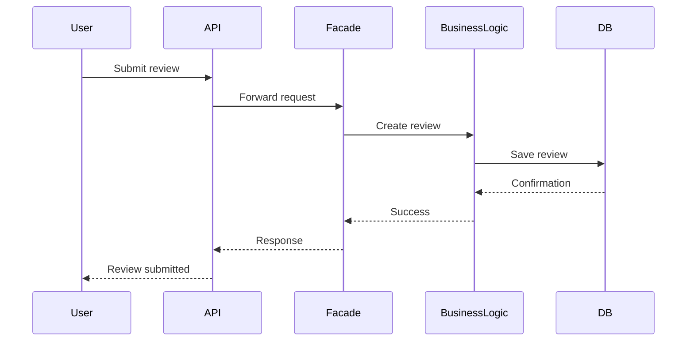
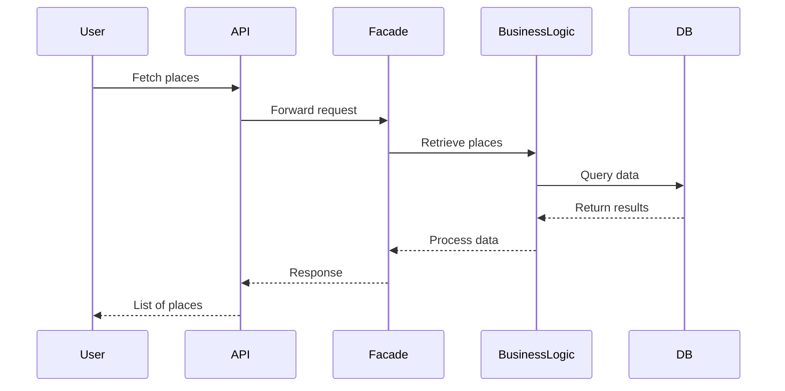

# HBnB Technical Documentation

This document outlines the architectural blueprint, core business logic, and data flow for the HBnB application. Designed as a scalable vacation rental platform, the system relies on strict separation of concerns to ensure that the codebase remains maintainable and extensible as new features are introduced.

---

# 1. High-Level Architecture

The application is built using a **3-tier architecture**, ensuring clear separation between presentation, business logic, and data persistence. To avoid tight coupling between layers, the system uses the **Facade Design Pattern**, which provides a unified interface for all core operations.

## Presentation Layer (API)
This layer represents the entry point of the system. It is responsible for handling HTTP requests, parsing input data, and returning responses.

It does not contain any business logic. Its only responsibility is communication with external clients.

---

## Business Logic Layer (Services & Models)
This layer represents the core of the system.

It is responsible for:
- enforcing business rules
- validating input data
- processing application logic
- managing relationships between entities

All requests from the API pass through the Facade before reaching this layer.

---

## Persistence Layer (Repositories)
This layer abstracts all database operations.

It is responsible for:
- storing data
- retrieving data
- updating records
- deleting records

The business logic layer never interacts directly with the database. All operations go through repositories.

---

## Facade Pattern

The Facade acts as a centralized interface between the API and the business logic layer.

Instead of multiple direct calls to different services or models, the API interacts with a single entry point.

For example:
- API → Facade → create_place()
- API → Facade → create_user()

The Facade internally coordinates all required operations across services and repositories.

---

## Package Diagram

```mermaid
graph TD

subgraph Presentation Layer
    API
    Services
end

subgraph Business Logic Layer
    Facade
    User
    Place
    Review
    Amenity
end

subgraph Persistence Layer
    Repository
    Database
end

API --> Facade
Services --> Facade

Facade --> User
Facade --> Place
Facade --> Review
Facade --> Amenity

User --> Repository
Place --> Repository
Review --> Repository
Amenity --> Repository

Repository --> Database
````

---

# 2. Business Logic Layer & Domain Models

The domain layer represents the real-world entities of the HBnB system.

Each entity is uniquely identified using a **UUID4**, ensuring global uniqueness across the system. Additionally, all entities track lifecycle metadata such as creation and update timestamps.

This ensures consistency, traceability, and auditability across the application.

---

## Entity Relationships

### User & Place (One-to-Many)

A user can own multiple places. Each place contains a reference to its owner through a foreign key relationship.

---

### User, Place & Review

The Review entity acts as a linking entity between a User and a Place.

It represents a user’s feedback on a specific place and includes:

* rating
* comment

Each review belongs to exactly one user and one place.

---

### Place & Amenity (Many-to-Many)

A place can have multiple amenities, and an amenity can belong to multiple places.

This relationship allows reuse of common features such as Wi-Fi, parking, or pool access across different listings.

---

## Class Diagram

```mermaid
classDiagram

class User {
    +UUID id
    +string first_name
    +string last_name
    +string email
    +string password
    +bool is_admin
    +datetime created_at
    +datetime updated_at
}

class Place {
    +UUID id
    +string title
    +string description
    +float price
    +float latitude
    +float longitude
    +datetime created_at
    +datetime updated_at
}

class Review {
    +UUID id
    +string text
    +int rating
    +datetime created_at
    +datetime updated_at
}

class Amenity {
    +UUID id
    +string name
    +string description
    +datetime created_at
    +datetime updated_at
}

User "1" --> "*" Place : owns
User "1" --> "*" Review : writes
Place "1" --> "*" Review : has
Place "*" --> "*" Amenity : includes
```

---

# 3. API Interaction Flow

All interactions between the client and the system follow a strict layered flow.

Direct communication between the API and the database is not allowed. Instead, all operations pass through the Facade and Business Logic layers.

Before executing any write operation, the system validates related entities to ensure data integrity and prevent invalid references.

---

## User Registration



---

## Place Creation



---

## Review Submission



---

## Fetch Places



---
