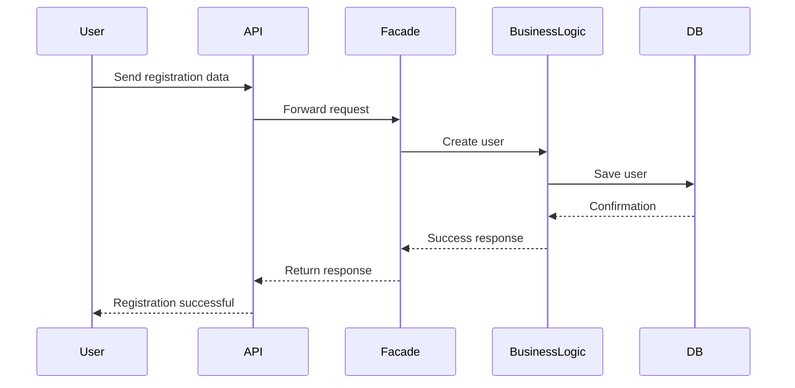
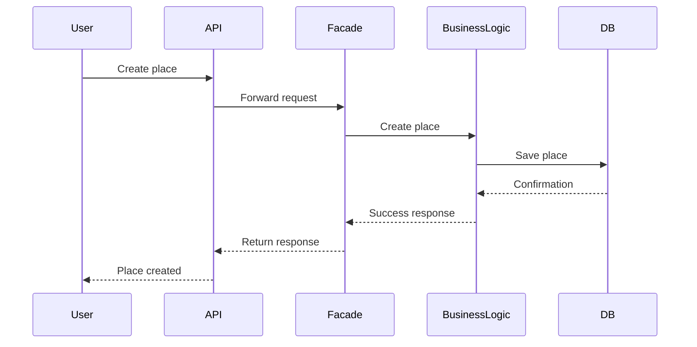
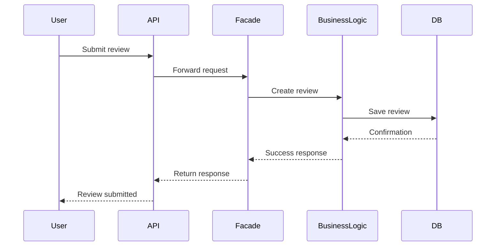
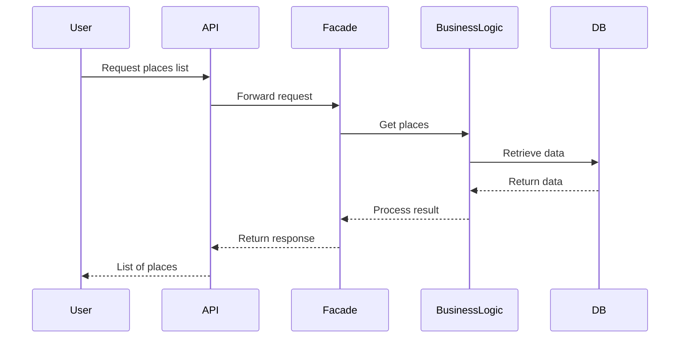

````markdown
# HBnB Evolution – Technical Documentation

## Introduction

This document describes the architecture and design of the HBnB Evolution application, a simplified system similar to Airbnb.

The purpose of this documentation is to define how the system is structured before implementation. It explains:

- how the system is divided into layers
- how components communicate
- how requests are processed step by step

The system is based on a three-layer architecture and uses the Facade design pattern to simplify communication between components.

---

# 1. High-Level Architecture (Package Diagram)

## Overview

This section describes the global structure of the application and how its components are organized into layers.

The system is divided into three main layers:

- Presentation Layer
- Business Logic Layer
- Persistence Layer

A Facade is used as a single entry point between layers to simplify communication.

---

## Layers Description

### Presentation Layer
Responsible for handling user requests.

Includes:
- API endpoints
- Services

This layer does not contain business logic. It only forwards requests.

---

### Business Logic Layer
This is the core of the system.

Includes:
- User
- Place
- Review
- Amenity

Responsible for:
- business rules
- validation
- relationships between entities

---

### Persistence Layer
Responsible for storing and retrieving data.

Includes:
- Repository
- Database

---

## Facade Pattern

The Facade acts as a single interface between the Presentation Layer and the Business Logic Layer.

Instead of multiple direct calls, all requests go through the Facade.

This improves:
- maintainability
- readability
- separation of concerns

---

## Package Diagram

```mermaid
graph TD

subgraph Presentation Layer
    API
    Services
end

subgraph Business Logic Layer
    Facade
    User
    Place
    Review
    Amenity
end

subgraph Persistence Layer
    Repository
    Database
end

API --> Facade
Services --> Facade

Facade --> User
Facade --> Place
Facade --> Review
Facade --> Amenity

User --> Repository
Place --> Repository
Review --> Repository
Amenity --> Repository

Repository --> Database
````

---

# 2. Business Logic Layer (Class Diagram)

## Overview

This layer defines the main entities of the system and their relationships.

Each entity includes:

* unique identifier (UUID)
* creation timestamp
* update timestamp

---

## Class Diagram

```mermaid
classDiagram

class User {
    +UUID id
    +string first_name
    +string last_name
    +string email
    +string password
    +bool is_admin
    +datetime created_at
    +datetime updated_at
}

class Place {
    +UUID id
    +string title
    +string description
    +float price
    +float latitude
    +float longitude
    +datetime created_at
    +datetime updated_at
}

class Review {
    +UUID id
    +string text
    +int rating
    +datetime created_at
    +datetime updated_at
}

class Amenity {
    +UUID id
    +string name
    +string description
    +datetime created_at
    +datetime updated_at
}

User "1" --> "*" Place : owns
User "1" --> "*" Review : writes
Place "1" --> "*" Review : has
Place "*" --> "*" Amenity : includes
```

---

## Summary

* A User can own multiple Places
* A User can write multiple Reviews
* A Place can have multiple Reviews
* A Place can include multiple Amenities
* An Amenity can belong to multiple Places

---

# 3. Sequence Diagrams (API Calls)

## Overview

This section describes how requests are processed through the system step by step.

Each request follows the same flow:

1. User sends request to API
2. API forwards request to Facade
3. Facade sends it to Business Logic
4. Business Logic interacts with Persistence Layer
5. Database processes data
6. Response is returned to the user

---

## 3.1 User Registration



---

## 3.2 Place Creation



---

## 3.3 Review Submission



---

## 3.4 Fetch Places List



---
```

---

Если хочешь дальше, могу:
- :contentReference[oaicite:0]{index=0}
- или :contentReference[oaicite:1]{index=1}
- или :contentReference[oaicite:2]{index=2}

Скажи 👍
```
