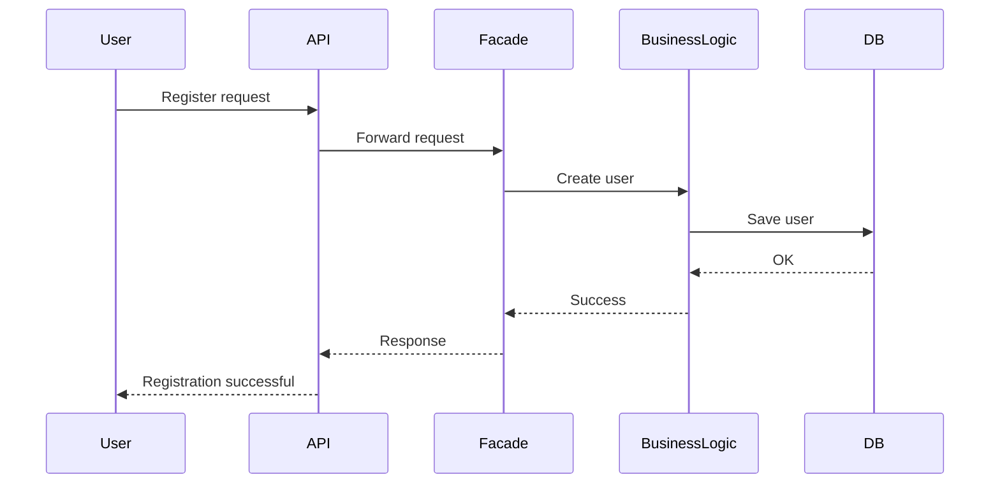
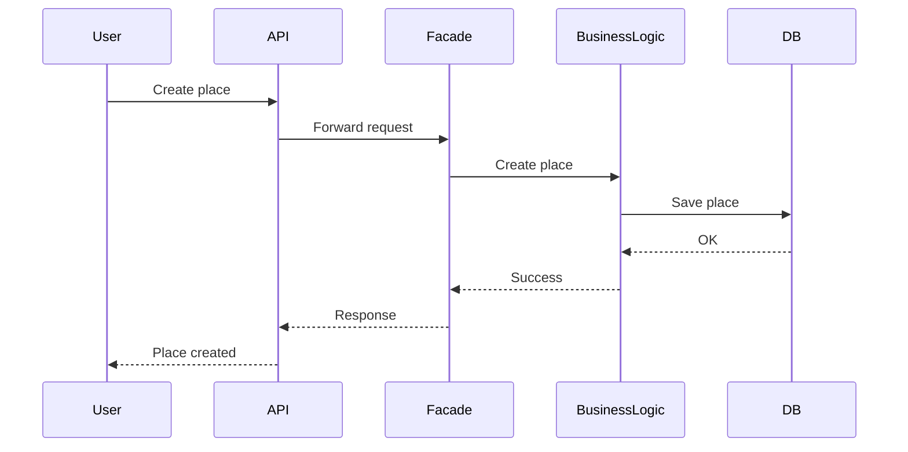
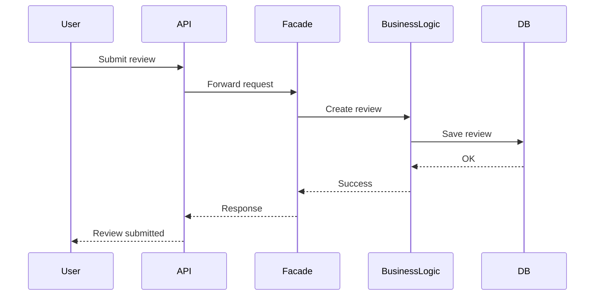
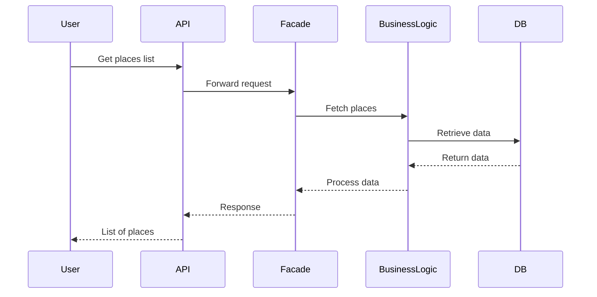

# HBnB Evolution – Technical Documentation

## Introduction

This document describes the architecture and design of the HBnB Evolution application, a simplified system similar to Airbnb.

The purpose of this documentation is to define how the system is structured before implementation. It explains:

- system architecture (layers)
- communication between components
- request processing flow

The system uses a **three-layer architecture** and a **Facade design pattern**.

---

# 1. High-Level Architecture (Package Diagram)

## Overview

The system is divided into three layers:

- Presentation Layer
- Business Logic Layer
- Persistence Layer

A Facade is used as a single entry point between layers.

---

## Layers Description

### Presentation Layer
Handles user requests:
- API endpoints
- Services

Does not contain business logic.

---

### Business Logic Layer
Core system logic:
- User
- Place
- Review
- Amenity

Responsible for rules, validation, and relationships.

---

### Persistence Layer
Handles data storage:
- Repository
- Database

---

## Facade Pattern

All communication goes through Facade:

API → Facade → Business Logic → Persistence

This reduces coupling and improves maintainability.

---

## Package Diagram

```mermaid
graph TD

subgraph Presentation Layer
    API
    Services
end

subgraph Business Logic Layer
    Facade
    User
    Place
    Review
    Amenity
end

subgraph Persistence Layer
    Repository
    Database
end

API --> Facade
Services --> Facade

Facade --> User
Facade --> Place
Facade --> Review
Facade --> Amenity

User --> Repository
Place --> Repository
Review --> Repository
Amenity --> Repository

Repository --> Database
````

---

# 2. Business Logic Layer (Class Diagram)

## Overview

Defines system entities and relationships.

Each entity contains:

* UUID
* created_at
* updated_at

---

## Class Diagram

```mermaid
classDiagram

class User {
    +UUID id
    +string first_name
    +string last_name
    +string email
    +string password
    +bool is_admin
    +datetime created_at
    +datetime updated_at
}

class Place {
    +UUID id
    +string title
    +string description
    +float price
    +float latitude
    +float longitude
    +datetime created_at
    +datetime updated_at
}

class Review {
    +UUID id
    +string text
    +int rating
    +datetime created_at
    +datetime updated_at
}

class Amenity {
    +UUID id
    +string name
    +string description
    +datetime created_at
    +datetime updated_at
}

User "1" --> "*" Place : owns
User "1" --> "*" Review : writes
Place "1" --> "*" Review : has
Place "*" --> "*" Amenity : includes
```

---

## Summary

* User owns multiple places
* User writes multiple reviews
* Place has multiple reviews
* Place has multiple amenities

---

# 3. Sequence Diagrams (API Calls)

## Overview

All requests follow the same flow:

1. User sends request to API
2. API sends request to Facade
3. Facade calls Business Logic
4. Business Logic uses Persistence Layer
5. Database returns data
6. Response goes back to user

---

## User Registration



---

## Place Creation



---

## Review Submission



---

## Fetch Places List



---
