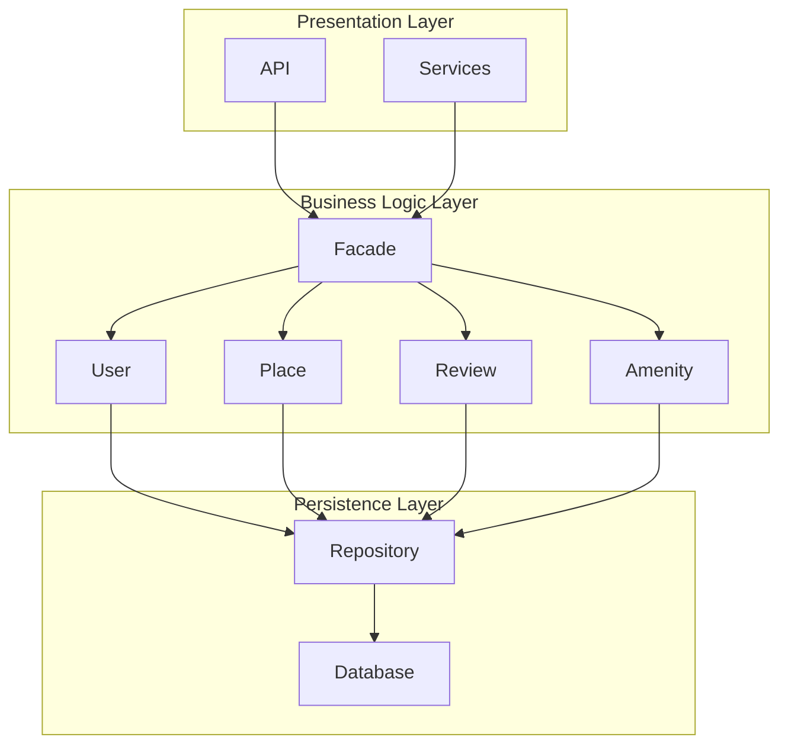
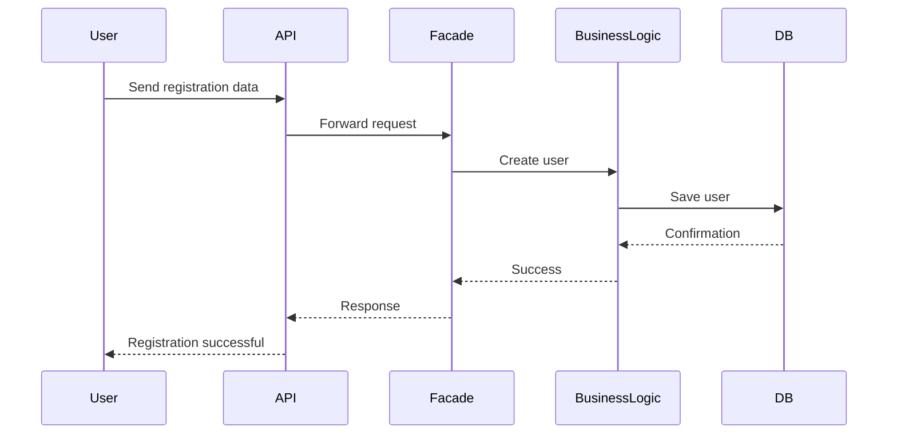
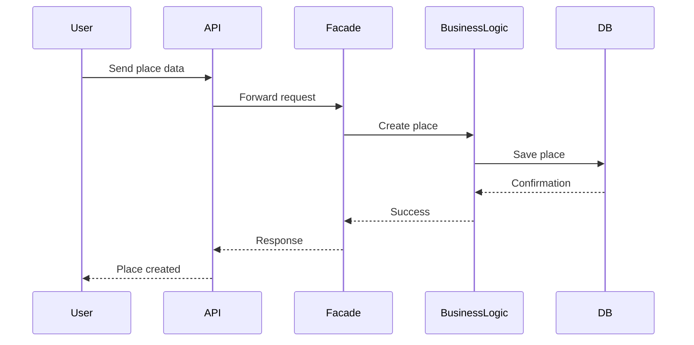
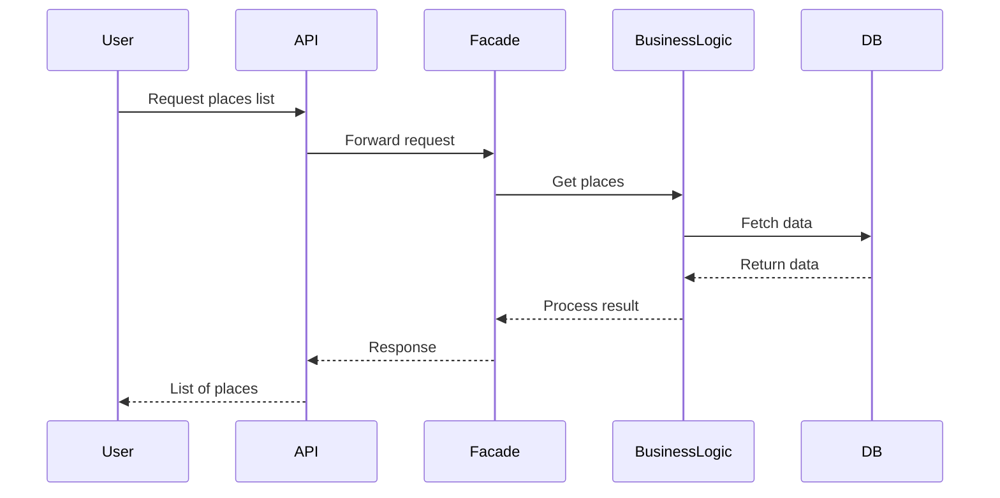

# HBnB Evolution – Technical Documentation

## Introduction

This document describes the architecture and design of the HBnB Evolution application, a simplified system similar to Airbnb.

The purpose of this documentation is to define how the system is structured before implementation. It explains:

* how the system is divided into layers
* how components communicate
* how requests are processed step by step

The system is based on a three-layer architecture and uses the Facade design pattern to simplify communication between components.

---

# 1. High-Level Architecture (Package Diagram)

## 1.1 What this task means (simple explanation)

In this part, we are not writing code. We are drawing a “map” of the whole system.

This map shows:

* what parts the system is made of
* how these parts are grouped
* how they communicate with each other

Think of it like a building:

* Presentation Layer = the entrance (where users interact)
* Business Logic Layer = the brain (decides what to do)
* Persistence Layer = storage room (saves everything)

We also introduce something called a Facade, which acts like a receptionist:
instead of talking to many departments, you talk to only one person (Facade), and it handles everything for you.

---

## 1.2 Layers of the system

### Presentation Layer

This is the part that receives requests from users.

It includes:

* API (endpoints like /users, /places)
* Services (helpers that prepare requests)

It does NOT contain business rules. It only sends requests deeper into the system.

---

### Business Logic Layer

This is the core of the system.

It contains:

* User
* Place
* Review
* Amenity

This layer decides:

* what is allowed
* how data should be processed
* how entities relate to each other

---

### Persistence Layer

This layer is responsible for storing data.

It includes:

* Repository (handles database operations)
* Database (actual storage)

---

## 1.3 Facade Pattern (important concept)

The Facade is a middle layer between API and business logic.

Instead of doing this:

* API → User model
* API → Place model
* API → Review model

We do this:

* API → Facade → everything else

This makes the system:

* easier to understand
* easier to maintain
* less dependent between parts

---

## 1.4 Package Diagram

---

## 1.5 Summary of Task 1

This diagram shows the structure of the entire application.

The most important idea is:

* users do not interact with business logic directly
* everything goes through Facade
* data is stored in a separate layer (database)

This separation makes the system organized and scalable.

---

# 2. Business Logic Layer (Class Diagram)

This section defines the internal structure of the system:

* what objects exist
* what data they store
* how they are connected

Each object has:

* a unique ID (UUID)
* creation date
* update date

Main entities:

* User
* Place
* Review
* Amenity

(kept from previous version, unchanged logic)

---

# 3. Sequence Diagrams (API Calls)

## 3.1 What this task means (simple explanation)

This part shows how a request moves through the system step by step.

Instead of showing structure (like Task 1), here we show:

* what happens first
* what happens next
* who talks to whom
* how data moves

Think of it like a story:

A user clicks “Register” → request goes through system → user is created → response is returned.

We repeat this story for different actions.

---

## 3.2 General flow (very important)

Every request follows the same pattern:

1. User sends request to API
2. API forwards request to Facade
3. Facade sends it to Business Logic
4. Business Logic processes it
5. Persistence Layer saves or retrieves data
6. Response goes back to user

This flow never changes.

---

## 3.3 User Registration

### What happens here

A new user creates an account.

Step by step:

* user sends registration data (email, password, etc.)
* API receives request
* API sends it to Facade
* Facade tells User logic to create a user
* system saves user in database
* system returns success response

---

## 3.4 Place Creation

### What happens here

A logged-in user creates a place (like an apartment).

Step by step:

* user sends place details
* API receives request
* Facade processes it
* Place is created in business logic
* saved in database
* response returned

---

## 3.5 Review Submission

### What happens here

A user writes a review for a place.

Step by step:

* user sends rating and comment
* API forwards request
* Facade processes it
* review is validated
* saved in database
* response returned

---

## 3.6 Fetching Places List

### What happens here

A user requests a list of places.

Step by step:

* API receives request
* Facade asks business logic for places
* database returns list
* data is sent back to user

---
