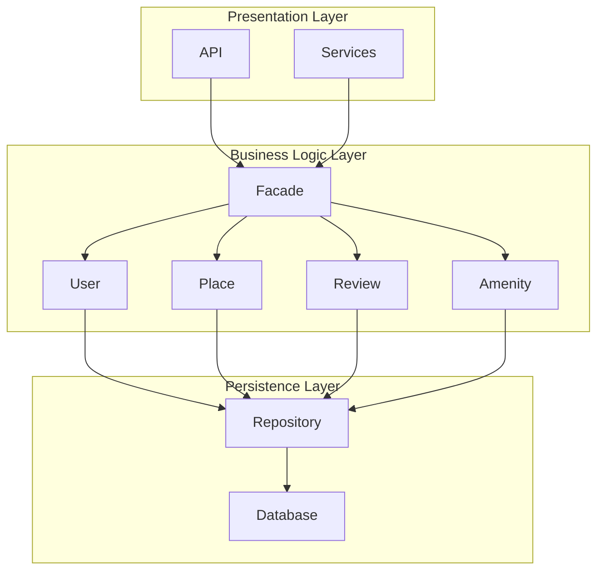
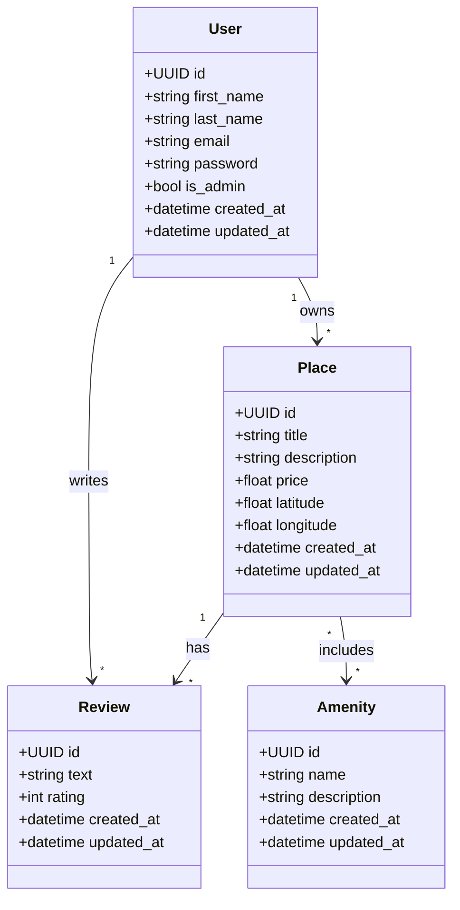
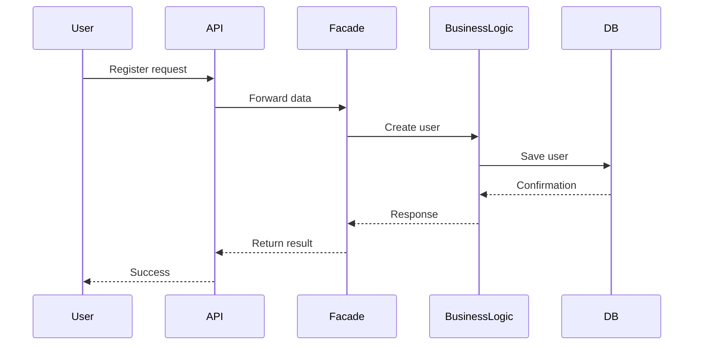
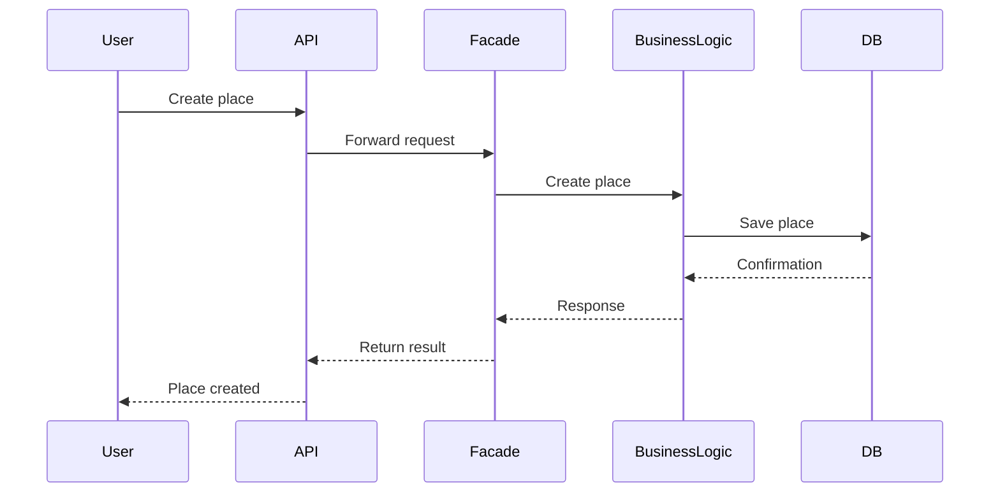
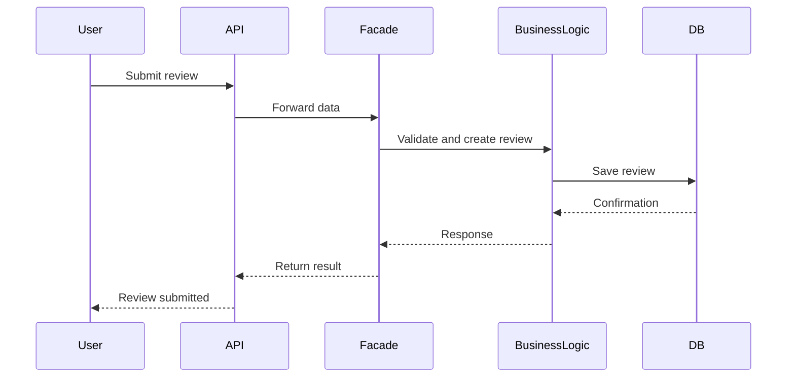
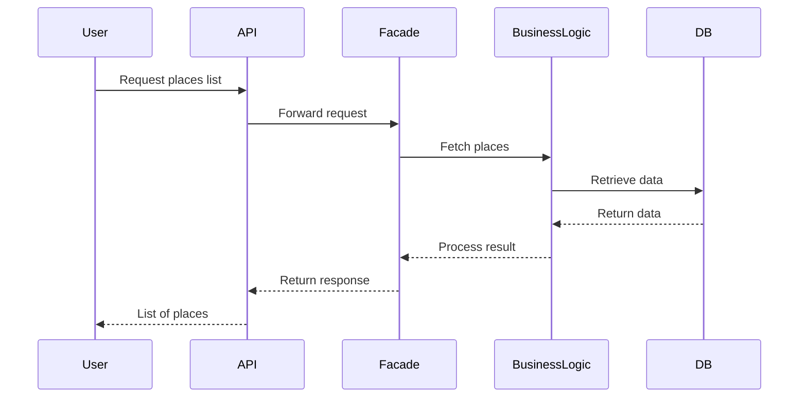

# HBnB Evolution – Technical Documentation

## 📌 Introduction

This document presents the complete technical design of the **HBnB Evolution** application, a simplified Airbnb-like system.

The purpose of this documentation is to define a clear architectural blueprint before implementation. It describes:

* System architecture (3-layer design)
* Business logic structure
* API interaction flows

The system follows a **layered architecture** with a **Facade Pattern** to ensure separation of concerns and scalability.

---

# 🏗 High-Level Architecture

The system is divided into three layers:

## 🔹 Presentation Layer

Handles user interaction:

* API
* Services

## 🔹 Business Logic Layer

Contains core application logic:

* User
* Place
* Review
* Amenity

## 🔹 Persistence Layer

Handles data storage:

* Repository
* Database

---

## 🔄 Facade Pattern

The Facade acts as a single entry point between layers.

### Flow:

Presentation → Facade → Business Logic → Persistence

### Benefits:

* Simplifies communication
* Reduces coupling
* Centralizes logic access

---

## 📊 Package Diagram

---

# 🧠 Business Logic Layer

This layer defines the core entities of the system.

---

## 👤 User

Represents a system user.

### Attributes:

* id (UUID)
* first_name
* last_name
* email
* password
* is_admin
* created_at
* updated_at

### Responsibilities:

* User management
* Ownership of places
* Writing reviews

---

## 🏠 Place

Represents a property listing.

### Attributes:

* id (UUID)
* title
* description
* price
* latitude
* longitude
* created_at
* updated_at

### Responsibilities:

* Store property data
* Link to owner
* Contain reviews and amenities

---

## ⭐ Review

Represents user feedback.

### Attributes:

* id (UUID)
* text
* rating
* created_at
* updated_at

### Responsibilities:

* Connect users and places
* Store feedback

---

## 🛠 Amenity

Represents features of a place.

### Attributes:

* id (UUID)
* name
* description
* created_at
* updated_at

### Responsibilities:

* Define features like Wi-Fi, parking
* Link to multiple places

---

## 📈 Class Diagram

---

# 🔄 API Interaction Flow

All requests follow this flow:

1. Client sends request to API
2. API forwards to Facade
3. Facade calls Business Logic
4. Business Logic interacts with Persistence Layer
5. Database returns data
6. Response is sent back to client

---

# 👤 User Registration

---

# 🏠 Place Creation

---

# ⭐ Review Submission

---

# 📋 Fetch Places List

---

# ✅ Conclusion

This document defines the full architecture of the **HBnB Evolution system**.

It includes:

* Three-layer architecture
* Facade design pattern
* Core business entities
* Class relationships
* API interaction flows

The design ensures:

* Scalability
* Maintainability
* Clear separation of concerns

This serves as the complete blueprint for implementation.
